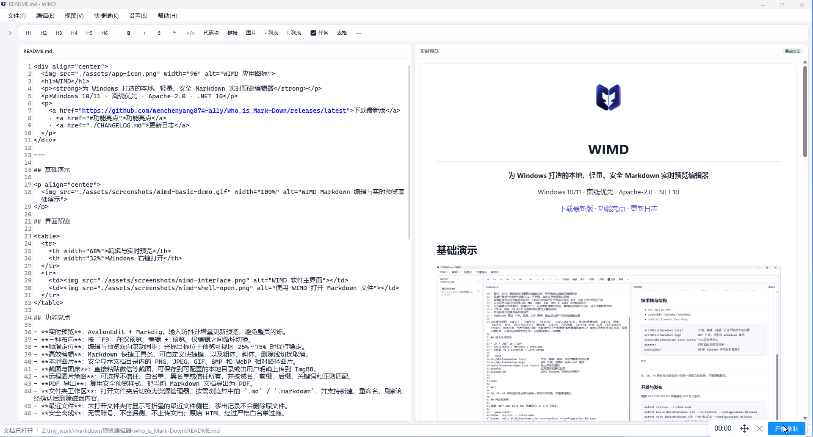
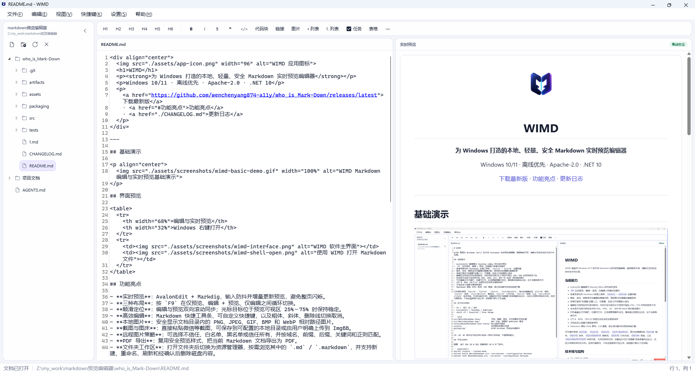
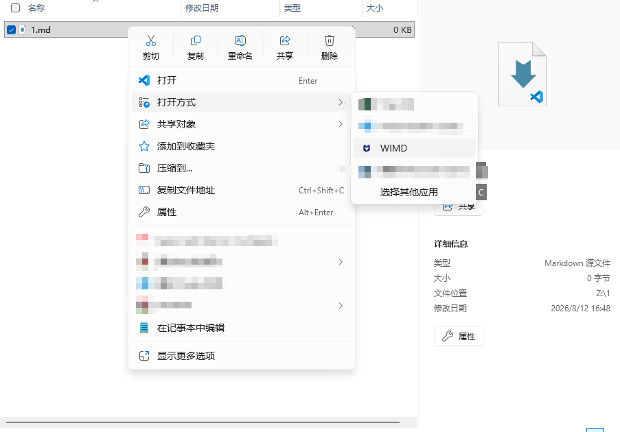

<div align="center">
  
  <h1>WIMD</h1>
  <p><strong>为 Windows 打造的本地、轻量、安全 Markdown 实时预览编辑器</strong></p>
  <p>Windows 10/11 · 离线优先 · Apache-2.0 · .NET 10</p>
  <p>
    <a href="https://github.com/wenchenyang874-a11y/who_is_Mark-Down/releases/latest">下载最新版</a>
    · <a href="#功能亮点">功能亮点</a>
    · <a href="./CHANGELOG.md">更新日志</a>
  </p>
</div>

---

## 基础演示

<p align="center">
  
</p>

## 界面预览

<table>
  <tr>
    <th width="68%">编辑与实时预览</th>
    <th width="32%">Windows 右键打开</th>
  </tr>
  <tr>
    <td></td>
    <td></td>
  </tr>
</table>

## 功能亮点

- **实时预览**：AvalonEdit + Markdig，输入防抖并增量更新预览，避免整页闪烁。
- **三种布局**：按 `F9` 在仅预览、编辑 + 预览、仅编辑之间循环切换。
- **顺滑定位**：编辑与预览双向滚动同步；光标目标位于预览可视区 25%～75% 时保持稳定。
- **高效编辑**：Markdown 快捷工具条、可自定义快捷键、粗体/斜体/删除线切换取消，以及可选择行列数的表格插入。
- **交互任务**：已完成任务以绿色显示，可直接在预览区点击复选框并同步修改 Markdown 状态。
- **代码块复制**：预览区代码块右上角提供复制按钮，一键复制纯代码并显示成功或失败反馈。
- **本地图片**：安全显示文档目录内的 PNG、JPEG、GIF、BMP 和 WebP 相对路径图片。
- **独立图片查看器**：单击预览图片后在单独窗口中打开，可最小化、最大化和拖动窗口；支持滚轮缩放、左键平移、100%、适应窗口和安全另存为。
- **截图与图床**：直接粘贴微信等截图，可保存到可配置的本地目录或由用户明确上传到 ImgBB。
- **远程图片策略**：可选择不信任、白名单、黑名单或信任所有，并按域名、前缀、后缀、关键词和正则匹配。
- **PDF 导出**：复用安全预览样式，把当前 Markdown 文档导出为 PDF。
- **文件夹工作区**：打开文件夹后切换为资源管理器，按需浏览其中的 `.md` / `.markdown`，并支持新建、重命名、刷新、在新窗口中打开和经确认后删除磁盘内容。
- **最近文件**：未打开文件夹时显示可折叠的最近文件侧栏，当前正在编辑的文件以主题色高亮；当前运行期间切换已有记录不会打乱列表，下一次启动时再按最新打开时间排序；可右键在新窗口中打开，移出记录不会删除原文件。
- **安全离线**：无需账号、不含遥测、不上传文档；原始 HTML 经过严格白名单过滤。
- **个性背景**：选择本地图片铺满整个应用窗口，标题栏、菜单、侧栏、快捷工具栏、编辑区、预览区和状态栏均可透出背景；代码块与表格使用分层半透明表面维持可读性，背景可见度 0% 为完全隐藏，100% 为最清晰。
- **主题与字体**：提供跟随 Windows、明亮、深色和暖色护眼主题；编辑区与预览区可分别设置字号和本机已安装字体，直接在字体下拉框输入中文名或英文名即可筛选。
- **安全更新**：可从“帮助 → 检查更新”查询 GitHub Release；也可自行启用启动检查。下载前会校验正式版本、安装包名称、大小和 SHA-256，安装始终需要用户确认。
- **更新后恢复**：覆盖更新正在运行的 WIMD 时，安装器会先说明关闭与恢复流程；未保存正文只写入本机临时恢复区，完成页默认重新打开并恢复原窗口，正文继续保持未保存状态。该临时恢复只用于安装器触发的关闭；用户平时退出 WIMD 时仍会收到保存、不保存或取消提示。
- **性能状态**：底部状态栏每秒显示当前 WIMD 主进程的 CPU 占用和工作集内存，便于观察单个应用实例的资源变化。

## 快速开始

1. 前往 [Releases](https://github.com/wenchenyang874-a11y/who_is_Mark-Down/releases/latest) 下载最新的 Windows x64 安装包。
2. 运行简体中文安装向导。若检测到已有 WIMD，确认后会在原目录覆盖升级；支持更新恢复的 WIMD 正在运行时，可在安装后重新打开并恢复窗口与未保存内容。
3. 启动 WIMD，通过“文件 → 打开文件夹”进入工作区模式，或直接打开单个 `.md` / `.markdown` 文件。

> WIMD 的核心编辑和预览可完全离线运行。检查更新只会在用户主动操作或明确启用“启动时检查更新”后联网，软件不会静默下载或安装更新。

## 常用快捷键

| 功能 | 快捷键 |
| --- | --- |
| 新建 / 打开 / 保存 / 另存为 | `Ctrl+N` / `Ctrl+O` / `Ctrl+S` / `Ctrl+Shift+S` |
| 一至六级标题 | `Ctrl+1` ～ `Ctrl+6` |
| 粗体 / 斜体 / 删除线 | `Ctrl+B` / `Ctrl+I` / `Ctrl+Shift+X` |
| 行内代码 / 链接 | `Ctrl+E` / `Ctrl+K` |
| 循环切换视图 | `F9` |

完整组合可在应用顶部的“快捷键”菜单中查看、自定义或恢复默认值；冲突组合会被自动拒绝。

## 安全与隐私

- 文档内容只在本机处理，不上传、不遥测。
- 字体只引用 Windows 中已安装的字体；WIMD 不附带、复制、上传或再分发字体文件。
- 更新只访问 WIMD 的 GitHub Release；下载并验证完成后仍需用户确认才会启动安装程序。
- 安装器触发更新关闭时，未保存正文仅短时写入当前 Windows 用户的 WIMD 临时恢复区；不会上传，也不会自动覆盖 Markdown 原文件。
- 远程图片默认不加载；危险协议、脚本、iframe、表单和事件属性会被拦截。
- 本地图片只允许来自当前文档目录；最近文件和背景操作不会删除原文件。
- Windows 资源管理器调用使用独立路径参数，不把文件路径拼接为可执行命令。

## 开发

技术栈：C#、.NET 10、WPF、AvalonEdit、Markdig、WebView2、xUnit、Inno Setup。

```powershell
dotnet restore --locked-mode
dotnet build WhoIsMarkdown.sln --no-restore --configuration Release
dotnet test WhoIsMarkdown.sln --no-build --configuration Release
dotnet run --project src/WhoIsMarkdown.App/WhoIsMarkdown.App.csproj
dotnet format WhoIsMarkdown.sln --verify-no-changes
$releaseVersion = Read-Host '请输入三段式版本号（例如 1.2.3）'
./packaging/build-release.ps1 -Version $releaseVersion
```

核心代码位于 `src/`，测试位于 `tests/WhoIsMarkdown.Core.Tests/`，Windows 安装脚本位于 `packaging/`。IR、SR、AR 保存在仓库外的项目文档目录，不随源码提交。

## 版本与许可

版本变化见 [CHANGELOG.md](./CHANGELOG.md)。本项目采用 [Apache License 2.0](./LICENSE) 开源许可。
